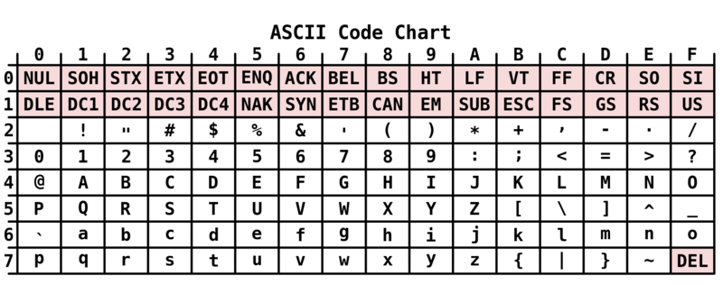
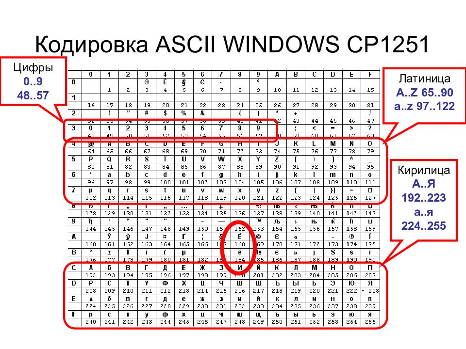
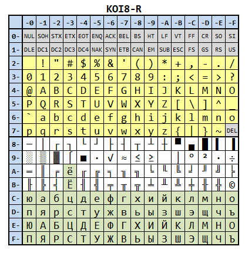

- [представление строк в компьюетре](#org388b7bf)
- [кодировки](#org67ec5b6)
  - [ASCII (1963)](#org6740de4)
  - [CP1251](#org8630334)
  - [KOI8-R](#org8002611)
  - [Unicode (1991)](#orgeba126b)
    - [UTF-8](#org05d0adc)
    - [UTF-16](#org339bec7)
    - [UTF-32](#org317a83b)
    - [Windows tricks](#org6490124)
- [Парсинг](#orgd44224a)
  - [Scrapy](#org3a50262)
- [защита от скраппинга](#org6d03e13)
- [Selenium](#orgb74d612)
- [парсинг PDF](#org55d2455)
- [Вопросы](#org060e12b)


<a id="org388b7bf"></a>

# представление строк в компьюетре

```python
print("Hello World")
print("1234")
```

```bash
hexdump -C example.py
```

    00000000  23 21 2f 75 73 72 2f 62  69 6e 2f 65 6e 76 20 70  |#!/usr/bin/env p|
    00000010  79 74 68 6f 6e 33 0a 70  72 69 6e 74 28 22 48 65  |ython3.print("He|
    00000020  6c 6c 6f 20 57 6f 72 6c  64 22 29 0a 70 72 69 6e  |llo World").prin|
    00000030  74 28 22 31 32 33 34 22  29 0a                    |t("1234").|
    0000003a

```python
with open("example.py", "rb") as fd:
    for line in fd.readlines():
        print("".join(f"{c:02b}" for c in line))
```

    1000111000011011111110101111001111100101011111100010110100111011101011111100101110111011101101000001110000111100111101001101000110111111011101100111010
    1110000111001011010011101110111010010100010001010010001100101110110011011001101111100000101011111011111110010110110011001001000101010011010
    111000011100101101001110111011101001010001000101100011100101100111101001000101010011010

```C
int main() {
    printf("Привет, мир!\n");
    printf("123\n");
    return 0;
}
```

    Привет, мир!
    123

```bash
gcc example.c -O0 -o example
hexdump -C example
```

```
00000000  7f 45 4c 46 02 01 01 00  00 00 00 00 00 00 00 00  |.ELF............|
00000010  03 00 3e 00 01 00 00 00  60 10 00 00 00 00 00 00  |..>.....`.......|
00000020  40 00 00 00 00 00 00 00  78 39 00 00 00 00 00 00  |@.......x9......|
00000030  00 00 00 00 40 00 38 00  0d 00 40 00 1f 00 1e 00  |....@.8...@.....|
00000040  06 00 00 00 04 00 00 00  40 00 00 00 00 00 00 00  |........@.......|
00000050  40 00 00 00 00 00 00 00  40 00 00 00 00 00 00 00  |@.......@.......|
00000060  d8 02 00 00 00 00 00 00  d8 02 00 00 00 00 00 00  |................|
00000070  08 00 00 00 00 00 00 00  03 00 00 00 04 00 00 00  |................|
00000080  18 03 00 00 00 00 00 00  18 03 00 00 00 00 00 00  |................|
00000090  18 03 00 00 00 00 00 00  1c 00 00 00 00 00 00 00  |................|
000000a0  1c 00 00 00 00 00 00 00  01 00 00 00 00 00 00 00  |................|
000000b0  01 00 00 00 04 00 00 00  00 00 00 00 00 00 00 00  |................|
000000c0  00 00 00 00 00 00 00 00  00 00 00 00 00 00 00 00  |................|
000000d0  f8 05 00 00 00 00 00 00  f8 05 00 00 00 00 00 00  |................|
000000e0  00 10 00 00 00 00 00 00  01 00 00 00 05 00 00 00  |................|
000000f0  00 10 00 00 00 00 00 00  00 10 00 00 00 00 00 00  |................|
00000100  00 10 00 00 00 00 00 00  f5 01 00 00 00 00 00 00  |................|
00000110  f5 01 00 00 00 00 00 00  00 10 00 00 00 00 00 00  |................|
00000120  01 00 00 00 04 00 00 00  00 20 00 00 00 00 00 00  |......... ......|
00000130  00 20 00 00 00 00 00 00  00 20 00 00 00 00 00 00  |. ....... ......|
00000140  70 01 00 00 00 00 00 00  70 01 00 00 00 00 00 00  |p.......p.......|
00000150  00 10 00 00 00 00 00 00  01 00 00 00 06 00 00 00  |................|
00000160  b8 2d 00 00 00 00 00 00  b8 3d 00 00 00 00 00 00  |.-.......=......|
00000170  b8 3d 00 00 00 00 00 00  58 02 00 00 00 00 00 00  |.=......X.......|
00000180  60 02 00 00 00 00 00 00  00 10 00 00 00 00 00 00  |`...............|
00000190  02 00 00 00 06 00 00 00  c8 2d 00 00 00 00 00 00  |.........-......|
000001a0  c8 3d 00 00 00 00 00 00  c8 3d 00 00 00 00 00 00  |.=.......=......|
000001b0  f0 01 00 00 00 00 00 00  f0 01 00 00 00 00 00 00  |................|
000001c0  08 00 00 00 00 00 00 00  04 00 00 00 04 00 00 00  |................|
000001d0  38 03 00 00 00 00 00 00  38 03 00 00 00 00 00 00  |8.......8.......|
000001e0  38 03 00 00 00 00 00 00  20 00 00 00 00 00 00 00  |8....... .......|
000001f0  20 00 00 00 00 00 00 00  08 00 00 00 00 00 00 00  | ...............|
00000200  04 00 00 00 04 00 00 00  58 03 00 00 00 00 00 00  |........X.......|
00000210  58 03 00 00 00 00 00 00  58 03 00 00 00 00 00 00  |X.......X.......|
00000220  44 00 00 00 00 00 00 00  44 00 00 00 00 00 00 00  |D.......D.......|
00000230  04 00 00 00 00 00 00 00  53 e5 74 64 04 00 00 00  |........S.td....|
00000240  38 03 00 00 00 00 00 00  38 03 00 00 00 00 00 00  |8.......8.......|
00000250  38 03 00 00 00 00 00 00  20 00 00 00 00 00 00 00  |8....... .......|
00000260  20 00 00 00 00 00 00 00  08 00 00 00 00 00 00 00  | ...............|
00000270  50 e5 74 64 04 00 00 00  20 20 00 00 00 00 00 00  |P.td....  ......|
00000280  20 20 00 00 00 00 00 00  20 20 00 00 00 00 00 00  |  ......  ......|
00000290  44 00 00 00 00 00 00 00  44 00 00 00 00 00 00 00  |D.......D.......|
000002a0  04 00 00 00 00 00 00 00  51 e5 74 64 06 00 00 00  |........Q.td....|
000002b0  00 00 00 00 00 00 00 00  00 00 00 00 00 00 00 00  |................|
*
000002d0  00 00 00 00 00 00 00 00  10 00 00 00 00 00 00 00  |................|
000002e0  52 e5 74 64 04 00 00 00  b8 2d 00 00 00 00 00 00  |R.td.....-......|
000002f0  b8 3d 00 00 00 00 00 00  b8 3d 00 00 00 00 00 00  |.=.......=......|
00000300  48 02 00 00 00 00 00 00  48 02 00 00 00 00 00 00  |H.......H.......|
00000310  01 00 00 00 00 00 00 00  2f 6c 69 62 36 34 2f 6c  |......../lib64/l|
00000320  64 2d 6c 69 6e 75 78 2d  78 38 36 2d 36 34 2e 73  |d-linux-x86-64.s|
00000330  6f 2e 32 00 00 00 00 00  04 00 00 00 10 00 00 00  |o.2.............|
00000340  05 00 00 00 47 4e 55 00  02 00 00 c0 04 00 00 00  |....GNU.........|
00000350  03 00 00 00 00 00 00 00  04 00 00 00 14 00 00 00  |................|
00000360  03 00 00 00 47 4e 55 00  bd 4e ae c4 68 76 ba a7  |....GNU..N..hv..|
00000370  d9 8f 3e 24 70 c0 ae f3  fa f2 51 65 04 00 00 00  |..>$p.....Qe....|
00000380  10 00 00 00 01 00 00 00  47 4e 55 00 00 00 00 00  |........GNU.....|
00000390  03 00 00 00 02 00 00 00  00 00 00 00 00 00 00 00  |................|
000003a0  02 00 00 00 06 00 00 00  01 00 00 00 06 00 00 00  |................|
000003b0  00 00 81 00 00 00 00 00  06 00 00 00 00 00 00 00  |................|
000003c0  d1 65 ce 6d 00 00 00 00  00 00 00 00 00 00 00 00  |.e.m............|
000003d0  00 00 00 00 00 00 00 00  00 00 00 00 00 00 00 00  |................|
000003e0  3d 00 00 00 20 00 00 00  00 00 00 00 00 00 00 00  |=... ...........|
000003f0  00 00 00 00 00 00 00 00  0b 00 00 00 12 00 00 00  |................|
00000400  00 00 00 00 00 00 00 00  00 00 00 00 00 00 00 00  |................|
00000410  1f 00 00 00 12 00 00 00  00 00 00 00 00 00 00 00  |................|
00000420  00 00 00 00 00 00 00 00  59 00 00 00 20 00 00 00  |........Y... ...|
00000430  00 00 00 00 00 00 00 00  00 00 00 00 00 00 00 00  |................|
00000440  68 00 00 00 20 00 00 00  00 00 00 00 00 00 00 00  |h... ...........|
00000450  00 00 00 00 00 00 00 00  10 00 00 00 22 00 00 00  |............"...|
00000460  00 00 00 00 00 00 00 00  00 00 00 00 00 00 00 00  |................|
00000470  00 6c 69 62 63 2e 73 6f  2e 36 00 70 75 74 73 00  |.libc.so.6.puts.|
00000480  5f 5f 63 78 61 5f 66 69  6e 61 6c 69 7a 65 00 5f  |__cxa_finalize._|
00000490  5f 6c 69 62 63 5f 73 74  61 72 74 5f 6d 61 69 6e  |_libc_start_main|
000004a0  00 47 4c 49 42 43 5f 32  2e 32 2e 35 00 5f 49 54  |.GLIBC_2.2.5._IT|
000004b0  4d 5f 64 65 72 65 67 69  73 74 65 72 54 4d 43 6c  |M_deregisterTMCl|
000004c0  6f 6e 65 54 61 62 6c 65  00 5f 5f 67 6d 6f 6e 5f  |oneTable.__gmon_|
000004d0  73 74 61 72 74 5f 5f 00  5f 49 54 4d 5f 72 65 67  |start__._ITM_reg|
000004e0  69 73 74 65 72 54 4d 43  6c 6f 6e 65 54 61 62 6c  |isterTMCloneTabl|
000004f0  65 00 00 00 00 00 02 00  02 00 00 00 00 00 02 00  |e...............|
00000500  01 00 01 00 01 00 00 00  10 00 00 00 00 00 00 00  |................|
00000510  75 1a 69 09 00 00 02 00  31 00 00 00 00 00 00 00  |u.i.....1.......|
00000520  b8 3d 00 00 00 00 00 00  08 00 00 00 00 00 00 00  |.=..............|
00000530  40 11 00 00 00 00 00 00  c0 3d 00 00 00 00 00 00  |@........=......|
00000540  08 00 00 00 00 00 00 00  00 11 00 00 00 00 00 00  |................|
00000550  08 40 00 00 00 00 00 00  08 00 00 00 00 00 00 00  |.@..............|
00000560  08 40 00 00 00 00 00 00  d8 3f 00 00 00 00 00 00  |.@.......?......|
00000570  06 00 00 00 01 00 00 00  00 00 00 00 00 00 00 00  |................|
00000580  e0 3f 00 00 00 00 00 00  06 00 00 00 03 00 00 00  |.?..............|
00000590  00 00 00 00 00 00 00 00  e8 3f 00 00 00 00 00 00  |.........?......|
000005a0  06 00 00 00 04 00 00 00  00 00 00 00 00 00 00 00  |................|
000005b0  f0 3f 00 00 00 00 00 00  06 00 00 00 05 00 00 00  |.?..............|
000005c0  00 00 00 00 00 00 00 00  f8 3f 00 00 00 00 00 00  |.........?......|
000005d0  06 00 00 00 06 00 00 00  00 00 00 00 00 00 00 00  |................|
000005e0  d0 3f 00 00 00 00 00 00  07 00 00 00 02 00 00 00  |.?..............|
000005f0  00 00 00 00 00 00 00 00  00 00 00 00 00 00 00 00  |................|
*
00001000  f3 0f 1e fa 48 83 ec 08  48 8b 05 d9 2f 00 00 48  |....H...H.../..H|
00001010  85 c0 74 02 ff d0 48 83  c4 08 c3 00 00 00 00 00  |..t...H.........|
00001020  ff 35 9a 2f 00 00 f2 ff  25 9b 2f 00 00 0f 1f 00  |.5./....%./.....|
00001030  f3 0f 1e fa 68 00 00 00  00 f2 e9 e1 ff ff ff 90  |....h...........|
00001040  f3 0f 1e fa f2 ff 25 ad  2f 00 00 0f 1f 44 00 00  |......%./....D..|
00001050  f3 0f 1e fa f2 ff 25 75  2f 00 00 0f 1f 44 00 00  |......%u/....D..|
00001060  f3 0f 1e fa 31 ed 49 89  d1 5e 48 89 e2 48 83 e4  |....1.I..^H..H..|
00001070  f0 50 54 4c 8d 05 66 01  00 00 48 8d 0d ef 00 00  |.PTL..f...H.....|
00001080  00 48 8d 3d c1 00 00 00  ff 15 52 2f 00 00 f4 90  |.H.=......R/....|
00001090  48 8d 3d 79 2f 00 00 48  8d 05 72 2f 00 00 48 39  |H.=y/..H..r/..H9|
000010a0  f8 74 15 48 8b 05 2e 2f  00 00 48 85 c0 74 09 ff  |.t.H.../..H..t..|
000010b0  e0 0f 1f 80 00 00 00 00  c3 0f 1f 80 00 00 00 00  |................|
000010c0  48 8d 3d 49 2f 00 00 48  8d 35 42 2f 00 00 48 29  |H.=I/..H.5B/..H)|
000010d0  fe 48 89 f0 48 c1 ee 3f  48 c1 f8 03 48 01 c6 48  |.H..H..?H...H..H|
000010e0  d1 fe 74 14 48 8b 05 05  2f 00 00 48 85 c0 74 08  |..t.H.../..H..t.|
000010f0  ff e0 66 0f 1f 44 00 00  c3 0f 1f 80 00 00 00 00  |..f..D..........|
00001100  f3 0f 1e fa 80 3d 05 2f  00 00 00 75 2b 55 48 83  |.....=./...u+UH.|
00001110  3d e2 2e 00 00 00 48 89  e5 74 0c 48 8b 3d e6 2e  |=.....H..t.H.=..|
00001120  00 00 e8 19 ff ff ff e8  64 ff ff ff c6 05 dd 2e  |........d.......|
00001130  00 00 01 5d c3 0f 1f 00  c3 0f 1f 80 00 00 00 00  |...]............|
00001140  f3 0f 1e fa e9 77 ff ff  ff f3 0f 1e fa 55 48 89  |.....w.......UH.|
00001150  e5 48 8d 3d ac 0e 00 00  e8 f3 fe ff ff 48 8d 3d  |.H.=.........H.=|
00001160  b6 0e 00 00 e8 e7 fe ff  ff b8 00 00 00 00 5d c3  |..............].|
00001170  f3 0f 1e fa 41 57 4c 8d  3d 3b 2c 00 00 41 56 49  |....AWL.=;,..AVI|
00001180  89 d6 41 55 49 89 f5 41  54 41 89 fc 55 48 8d 2d  |..AUI..ATA..UH.-|
00001190  2c 2c 00 00 53 4c 29 fd  48 83 ec 08 e8 5f fe ff  |,,..SL).H...._..|
000011a0  ff 48 c1 fd 03 74 1f 31  db 0f 1f 80 00 00 00 00  |.H...t.1........|
000011b0  4c 89 f2 4c 89 ee 44 89  e7 41 ff 14 df 48 83 c3  |L..L..D..A...H..|
000011c0  01 48 39 dd 75 ea 48 83  c4 08 5b 5d 41 5c 41 5d  |.H9.u.H...[]A\A]|
000011d0  41 5e 41 5f c3 66 66 2e  0f 1f 84 00 00 00 00 00  |A^A_.ff.........|
000011e0  f3 0f 1e fa c3 00 00 00  f3 0f 1e fa 48 83 ec 08  |............H...|
000011f0  48 83 c4 08 c3 00 00 00  00 00 00 00 00 00 00 00  |H...............|
00001200  00 00 00 00 00 00 00 00  00 00 00 00 00 00 00 00  |................|
*
00002000  01 00 02 00 d0 9f d1 80  d0 b8 d0 b2 d0 b5 d1 82  |................|
00002010  2c 20 d0 bc d0 b8 d1 80  21 00 31 32 33 00 00 00  |, ......!.123...|
00002020  01 1b 03 3b 44 00 00 00  07 00 00 00 00 f0 ff ff  |...;D...........|
00002030  78 00 00 00 20 f0 ff ff  a0 00 00 00 30 f0 ff ff  |x... .......0...|
00002040  b8 00 00 00 40 f0 ff ff  60 00 00 00 29 f1 ff ff  |....@...`...)...|
00002050  d0 00 00 00 50 f1 ff ff  f0 00 00 00 c0 f1 ff ff  |....P...........|
00002060  38 01 00 00 00 00 00 00  14 00 00 00 00 00 00 00  |8...............|
00002070  01 7a 52 00 01 78 10 01  1b 0c 07 08 90 01 00 00  |.zR..x..........|
00002080  14 00 00 00 1c 00 00 00  d8 ef ff ff 2f 00 00 00  |............/...|
00002090  00 44 07 10 00 00 00 00  24 00 00 00 34 00 00 00  |.D......$...4...|
000020a0  80 ef ff ff 20 00 00 00  00 0e 10 46 0e 18 4a 0f  |.... ......F..J.|
000020b0  0b 77 08 80 00 3f 1a 3a  2a 33 24 22 00 00 00 00  |.w...?.:*3$"....|
000020c0  14 00 00 00 5c 00 00 00  78 ef ff ff 10 00 00 00  |....\...x.......|
000020d0  00 00 00 00 00 00 00 00  14 00 00 00 74 00 00 00  |............t...|
000020e0  70 ef ff ff 10 00 00 00  00 00 00 00 00 00 00 00  |p...............|
000020f0  1c 00 00 00 8c 00 00 00  51 f0 ff ff 27 00 00 00  |........Q...'...|
00002100  00 45 0e 10 86 02 43 0d  06 5e 0c 07 08 00 00 00  |.E....C..^......|
00002110  44 00 00 00 ac 00 00 00  58 f0 ff ff 65 00 00 00  |D.......X...e...|
00002120  00 46 0e 10 8f 02 49 0e  18 8e 03 45 0e 20 8d 04  |.F....I....E. ..|
00002130  45 0e 28 8c 05 44 0e 30  86 06 48 0e 38 83 07 47  |E.(..D.0..H.8..G|
00002140  0e 40 6e 0e 38 41 0e 30  41 0e 28 42 0e 20 42 0e  |.@n.8A.0A.(B. B.|
00002150  18 42 0e 10 42 0e 08 00  10 00 00 00 f4 00 00 00  |.B..B...........|
00002160  80 f0 ff ff 05 00 00 00  00 00 00 00 00 00 00 00  |................|
00002170  00 00 00 00 00 00 00 00  00 00 00 00 00 00 00 00  |................|
*
00002db0  00 00 00 00 00 00 00 00  40 11 00 00 00 00 00 00  |........@.......|
00002dc0  00 11 00 00 00 00 00 00  01 00 00 00 00 00 00 00  |................|
00002dd0  01 00 00 00 00 00 00 00  0c 00 00 00 00 00 00 00  |................|
00002de0  00 10 00 00 00 00 00 00  0d 00 00 00 00 00 00 00  |................|
00002df0  e8 11 00 00 00 00 00 00  19 00 00 00 00 00 00 00  |................|
00002e00  b8 3d 00 00 00 00 00 00  1b 00 00 00 00 00 00 00  |.=..............|
00002e10  08 00 00 00 00 00 00 00  1a 00 00 00 00 00 00 00  |................|
00002e20  c0 3d 00 00 00 00 00 00  1c 00 00 00 00 00 00 00  |.=..............|
00002e30  08 00 00 00 00 00 00 00  f5 fe ff 6f 00 00 00 00  |...........o....|
00002e40  a0 03 00 00 00 00 00 00  05 00 00 00 00 00 00 00  |................|
00002e50  70 04 00 00 00 00 00 00  06 00 00 00 00 00 00 00  |p...............|
00002e60  c8 03 00 00 00 00 00 00  0a 00 00 00 00 00 00 00  |................|
00002e70  82 00 00 00 00 00 00 00  0b 00 00 00 00 00 00 00  |................|
00002e80  18 00 00 00 00 00 00 00  15 00 00 00 00 00 00 00  |................|
00002e90  00 00 00 00 00 00 00 00  03 00 00 00 00 00 00 00  |................|
00002ea0  b8 3f 00 00 00 00 00 00  02 00 00 00 00 00 00 00  |.?..............|
00002eb0  18 00 00 00 00 00 00 00  14 00 00 00 00 00 00 00  |................|
00002ec0  07 00 00 00 00 00 00 00  17 00 00 00 00 00 00 00  |................|
00002ed0  e0 05 00 00 00 00 00 00  07 00 00 00 00 00 00 00  |................|
00002ee0  20 05 00 00 00 00 00 00  08 00 00 00 00 00 00 00  | ...............|
00002ef0  c0 00 00 00 00 00 00 00  09 00 00 00 00 00 00 00  |................|
00002f00  18 00 00 00 00 00 00 00  1e 00 00 00 00 00 00 00  |................|
00002f10  08 00 00 00 00 00 00 00  fb ff ff 6f 00 00 00 00  |...........o....|
00002f20  01 00 00 08 00 00 00 00  fe ff ff 6f 00 00 00 00  |...........o....|
00002f30  00 05 00 00 00 00 00 00  ff ff ff 6f 00 00 00 00  |...........o....|
00002f40  01 00 00 00 00 00 00 00  f0 ff ff 6f 00 00 00 00  |...........o....|
00002f50  f2 04 00 00 00 00 00 00  f9 ff ff 6f 00 00 00 00  |...........o....|
00002f60  03 00 00 00 00 00 00 00  00 00 00 00 00 00 00 00  |................|
00002f70  00 00 00 00 00 00 00 00  00 00 00 00 00 00 00 00  |................|
*
00002fb0  00 00 00 00 00 00 00 00  c8 3d 00 00 00 00 00 00  |.........=......|
00002fc0  00 00 00 00 00 00 00 00  00 00 00 00 00 00 00 00  |................|
00002fd0  30 10 00 00 00 00 00 00  00 00 00 00 00 00 00 00  |0...............|
00002fe0  00 00 00 00 00 00 00 00  00 00 00 00 00 00 00 00  |................|
*
00003000  00 00 00 00 00 00 00 00  08 40 00 00 00 00 00 00  |.........@......|
00003010  47 43 43 3a 20 28 55 62  75 6e 74 75 20 39 2e 34  |GCC: (Ubuntu 9.4|
00003020  2e 30 2d 31 75 62 75 6e  74 75 31 7e 32 30 2e 30  |.0-1ubuntu1~20.0|
00003030  34 2e 31 29 20 39 2e 34  2e 30 00 00 00 00 00 00  |4.1) 9.4.0......|
00003040  00 00 00 00 00 00 00 00  00 00 00 00 00 00 00 00  |................|
00003050  00 00 00 00 00 00 00 00  00 00 00 00 03 00 01 00  |................|
00003060  18 03 00 00 00 00 00 00  00 00 00 00 00 00 00 00  |................|
00003070  00 00 00 00 03 00 02 00  38 03 00 00 00 00 00 00  |........8.......|
00003080  00 00 00 00 00 00 00 00  00 00 00 00 03 00 03 00  |................|
00003090  58 03 00 00 00 00 00 00  00 00 00 00 00 00 00 00  |X...............|
000030a0  00 00 00 00 03 00 04 00  7c 03 00 00 00 00 00 00  |........|.......|
000030b0  00 00 00 00 00 00 00 00  00 00 00 00 03 00 05 00  |................|
000030c0  a0 03 00 00 00 00 00 00  00 00 00 00 00 00 00 00  |................|
000030d0  00 00 00 00 03 00 06 00  c8 03 00 00 00 00 00 00  |................|
000030e0  00 00 00 00 00 00 00 00  00 00 00 00 03 00 07 00  |................|
000030f0  70 04 00 00 00 00 00 00  00 00 00 00 00 00 00 00  |p...............|
00003100  00 00 00 00 03 00 08 00  f2 04 00 00 00 00 00 00  |................|
00003110  00 00 00 00 00 00 00 00  00 00 00 00 03 00 09 00  |................|
00003120  00 05 00 00 00 00 00 00  00 00 00 00 00 00 00 00  |................|
00003130  00 00 00 00 03 00 0a 00  20 05 00 00 00 00 00 00  |........ .......|
00003140  00 00 00 00 00 00 00 00  00 00 00 00 03 00 0b 00  |................|
00003150  e0 05 00 00 00 00 00 00  00 00 00 00 00 00 00 00  |................|
00003160  00 00 00 00 03 00 0c 00  00 10 00 00 00 00 00 00  |................|
00003170  00 00 00 00 00 00 00 00  00 00 00 00 03 00 0d 00  |................|
00003180  20 10 00 00 00 00 00 00  00 00 00 00 00 00 00 00  | ...............|
00003190  00 00 00 00 03 00 0e 00  40 10 00 00 00 00 00 00  |........@.......|
000031a0  00 00 00 00 00 00 00 00  00 00 00 00 03 00 0f 00  |................|
000031b0  50 10 00 00 00 00 00 00  00 00 00 00 00 00 00 00  |P...............|
000031c0  00 00 00 00 03 00 10 00  60 10 00 00 00 00 00 00  |........`.......|
000031d0  00 00 00 00 00 00 00 00  00 00 00 00 03 00 11 00  |................|
000031e0  e8 11 00 00 00 00 00 00  00 00 00 00 00 00 00 00  |................|
000031f0  00 00 00 00 03 00 12 00  00 20 00 00 00 00 00 00  |......... ......|
00003200  00 00 00 00 00 00 00 00  00 00 00 00 03 00 13 00  |................|
00003210  20 20 00 00 00 00 00 00  00 00 00 00 00 00 00 00  |  ..............|
00003220  00 00 00 00 03 00 14 00  68 20 00 00 00 00 00 00  |........h ......|
00003230  00 00 00 00 00 00 00 00  00 00 00 00 03 00 15 00  |................|
00003240  b8 3d 00 00 00 00 00 00  00 00 00 00 00 00 00 00  |.=..............|
00003250  00 00 00 00 03 00 16 00  c0 3d 00 00 00 00 00 00  |.........=......|
00003260  00 00 00 00 00 00 00 00  00 00 00 00 03 00 17 00  |................|
00003270  c8 3d 00 00 00 00 00 00  00 00 00 00 00 00 00 00  |.=..............|
00003280  00 00 00 00 03 00 18 00  b8 3f 00 00 00 00 00 00  |.........?......|
00003290  00 00 00 00 00 00 00 00  00 00 00 00 03 00 19 00  |................|
000032a0  00 40 00 00 00 00 00 00  00 00 00 00 00 00 00 00  |.@..............|
000032b0  00 00 00 00 03 00 1a 00  10 40 00 00 00 00 00 00  |.........@......|
000032c0  00 00 00 00 00 00 00 00  00 00 00 00 03 00 1b 00  |................|
000032d0  00 00 00 00 00 00 00 00  00 00 00 00 00 00 00 00  |................|
000032e0  01 00 00 00 04 00 f1 ff  00 00 00 00 00 00 00 00  |................|
000032f0  00 00 00 00 00 00 00 00  0c 00 00 00 02 00 10 00  |................|
00003300  90 10 00 00 00 00 00 00  00 00 00 00 00 00 00 00  |................|
00003310  0e 00 00 00 02 00 10 00  c0 10 00 00 00 00 00 00  |................|
00003320  00 00 00 00 00 00 00 00  21 00 00 00 02 00 10 00  |........!.......|
00003330  00 11 00 00 00 00 00 00  00 00 00 00 00 00 00 00  |................|
00003340  37 00 00 00 01 00 1a 00  10 40 00 00 00 00 00 00  |7........@......|
00003350  01 00 00 00 00 00 00 00  46 00 00 00 01 00 16 00  |........F.......|
00003360  c0 3d 00 00 00 00 00 00  00 00 00 00 00 00 00 00  |.=..............|
00003370  6d 00 00 00 02 00 10 00  40 11 00 00 00 00 00 00  |m.......@.......|
00003380  00 00 00 00 00 00 00 00  79 00 00 00 01 00 15 00  |........y.......|
00003390  b8 3d 00 00 00 00 00 00  00 00 00 00 00 00 00 00  |.=..............|
000033a0  98 00 00 00 04 00 f1 ff  00 00 00 00 00 00 00 00  |................|
000033b0  00 00 00 00 00 00 00 00  01 00 00 00 04 00 f1 ff  |................|
000033c0  00 00 00 00 00 00 00 00  00 00 00 00 00 00 00 00  |................|
000033d0  a2 00 00 00 01 00 14 00  6c 21 00 00 00 00 00 00  |........l!......|
000033e0  00 00 00 00 00 00 00 00  00 00 00 00 04 00 f1 ff  |................|
000033f0  00 00 00 00 00 00 00 00  00 00 00 00 00 00 00 00  |................|
00003400  b0 00 00 00 00 00 15 00  c0 3d 00 00 00 00 00 00  |.........=......|
00003410  00 00 00 00 00 00 00 00  c1 00 00 00 01 00 17 00  |................|
00003420  c8 3d 00 00 00 00 00 00  00 00 00 00 00 00 00 00  |.=..............|
00003430  ca 00 00 00 00 00 15 00  b8 3d 00 00 00 00 00 00  |.........=......|
00003440  00 00 00 00 00 00 00 00  dd 00 00 00 00 00 13 00  |................|
00003450  20 20 00 00 00 00 00 00  00 00 00 00 00 00 00 00  |  ..............|
00003460  f0 00 00 00 01 00 18 00  b8 3f 00 00 00 00 00 00  |.........?......|
00003470  00 00 00 00 00 00 00 00  ac 01 00 00 02 00 0c 00  |................|
00003480  00 10 00 00 00 00 00 00  00 00 00 00 00 00 00 00  |................|
00003490  06 01 00 00 12 00 10 00  e0 11 00 00 00 00 00 00  |................|
000034a0  05 00 00 00 00 00 00 00  16 01 00 00 20 00 00 00  |............ ...|
000034b0  00 00 00 00 00 00 00 00  00 00 00 00 00 00 00 00  |................|
000034c0  6c 01 00 00 20 00 19 00  00 40 00 00 00 00 00 00  |l... ....@......|
000034d0  00 00 00 00 00 00 00 00  32 01 00 00 12 00 00 00  |........2.......|
000034e0  00 00 00 00 00 00 00 00  00 00 00 00 00 00 00 00  |................|
000034f0  44 01 00 00 10 00 19 00  10 40 00 00 00 00 00 00  |D........@......|
00003500  00 00 00 00 00 00 00 00  10 01 00 00 12 02 11 00  |................|
00003510  e8 11 00 00 00 00 00 00  00 00 00 00 00 00 00 00  |................|
00003520  4b 01 00 00 12 00 00 00  00 00 00 00 00 00 00 00  |K...............|
00003530  00 00 00 00 00 00 00 00  6a 01 00 00 10 00 19 00  |........j.......|
00003540  00 40 00 00 00 00 00 00  00 00 00 00 00 00 00 00  |.@..............|
00003550  77 01 00 00 20 00 00 00  00 00 00 00 00 00 00 00  |w... ...........|
00003560  00 00 00 00 00 00 00 00  86 01 00 00 11 02 19 00  |................|
00003570  08 40 00 00 00 00 00 00  00 00 00 00 00 00 00 00  |.@..............|
00003580  93 01 00 00 11 00 12 00  00 20 00 00 00 00 00 00  |......... ......|
00003590  04 00 00 00 00 00 00 00  a2 01 00 00 12 00 10 00  |................|
000035a0  70 11 00 00 00 00 00 00  65 00 00 00 00 00 00 00  |p.......e.......|
000035b0  bc 00 00 00 10 00 1a 00  18 40 00 00 00 00 00 00  |.........@......|
000035c0  00 00 00 00 00 00 00 00  70 01 00 00 12 00 10 00  |........p.......|
000035d0  60 10 00 00 00 00 00 00  2f 00 00 00 00 00 00 00  |`......./.......|
000035e0  b2 01 00 00 10 00 1a 00  10 40 00 00 00 00 00 00  |.........@......|
000035f0  00 00 00 00 00 00 00 00  be 01 00 00 12 00 10 00  |................|
00003600  49 11 00 00 00 00 00 00  27 00 00 00 00 00 00 00  |I.......'.......|
00003610  c3 01 00 00 11 02 19 00  10 40 00 00 00 00 00 00  |.........@......|
00003620  00 00 00 00 00 00 00 00  cf 01 00 00 20 00 00 00  |............ ...|
00003630  00 00 00 00 00 00 00 00  00 00 00 00 00 00 00 00  |................|
00003640  e9 01 00 00 22 00 00 00  00 00 00 00 00 00 00 00  |...."...........|
00003650  00 00 00 00 00 00 00 00  00 63 72 74 73 74 75 66  |.........crtstuf|
00003660  66 2e 63 00 64 65 72 65  67 69 73 74 65 72 5f 74  |f.c.deregister_t|
00003670  6d 5f 63 6c 6f 6e 65 73  00 5f 5f 64 6f 5f 67 6c  |m_clones.__do_gl|
00003680  6f 62 61 6c 5f 64 74 6f  72 73 5f 61 75 78 00 63  |obal_dtors_aux.c|
00003690  6f 6d 70 6c 65 74 65 64  2e 38 30 36 31 00 5f 5f  |ompleted.8061.__|
000036a0  64 6f 5f 67 6c 6f 62 61  6c 5f 64 74 6f 72 73 5f  |do_global_dtors_|
000036b0  61 75 78 5f 66 69 6e 69  5f 61 72 72 61 79 5f 65  |aux_fini_array_e|
000036c0  6e 74 72 79 00 66 72 61  6d 65 5f 64 75 6d 6d 79  |ntry.frame_dummy|
000036d0  00 5f 5f 66 72 61 6d 65  5f 64 75 6d 6d 79 5f 69  |.__frame_dummy_i|
000036e0  6e 69 74 5f 61 72 72 61  79 5f 65 6e 74 72 79 00  |nit_array_entry.|
000036f0  65 78 61 6d 70 6c 65 2e  63 00 5f 5f 46 52 41 4d  |example.c.__FRAM|
00003700  45 5f 45 4e 44 5f 5f 00  5f 5f 69 6e 69 74 5f 61  |E_END__.__init_a|
00003710  72 72 61 79 5f 65 6e 64  00 5f 44 59 4e 41 4d 49  |rray_end._DYNAMI|
00003720  43 00 5f 5f 69 6e 69 74  5f 61 72 72 61 79 5f 73  |C.__init_array_s|
00003730  74 61 72 74 00 5f 5f 47  4e 55 5f 45 48 5f 46 52  |tart.__GNU_EH_FR|
00003740  41 4d 45 5f 48 44 52 00  5f 47 4c 4f 42 41 4c 5f  |AME_HDR._GLOBAL_|
00003750  4f 46 46 53 45 54 5f 54  41 42 4c 45 5f 00 5f 5f  |OFFSET_TABLE_.__|
00003760  6c 69 62 63 5f 63 73 75  5f 66 69 6e 69 00 5f 49  |libc_csu_fini._I|
00003770  54 4d 5f 64 65 72 65 67  69 73 74 65 72 54 4d 43  |TM_deregisterTMC|
00003780  6c 6f 6e 65 54 61 62 6c  65 00 70 75 74 73 40 40  |loneTable.puts@@|
00003790  47 4c 49 42 43 5f 32 2e  32 2e 35 00 5f 65 64 61  |GLIBC_2.2.5._eda|
000037a0  74 61 00 5f 5f 6c 69 62  63 5f 73 74 61 72 74 5f  |ta.__libc_start_|
000037b0  6d 61 69 6e 40 40 47 4c  49 42 43 5f 32 2e 32 2e  |main@@GLIBC_2.2.|
000037c0  35 00 5f 5f 64 61 74 61  5f 73 74 61 72 74 00 5f  |5.__data_start._|
000037d0  5f 67 6d 6f 6e 5f 73 74  61 72 74 5f 5f 00 5f 5f  |_gmon_start__.__|
000037e0  64 73 6f 5f 68 61 6e 64  6c 65 00 5f 49 4f 5f 73  |dso_handle._IO_s|
000037f0  74 64 69 6e 5f 75 73 65  64 00 5f 5f 6c 69 62 63  |tdin_used.__libc|
00003800  5f 63 73 75 5f 69 6e 69  74 00 5f 5f 62 73 73 5f  |_csu_init.__bss_|
00003810  73 74 61 72 74 00 6d 61  69 6e 00 5f 5f 54 4d 43  |start.main.__TMC|
00003820  5f 45 4e 44 5f 5f 00 5f  49 54 4d 5f 72 65 67 69  |_END__._ITM_regi|
00003830  73 74 65 72 54 4d 43 6c  6f 6e 65 54 61 62 6c 65  |sterTMCloneTable|
00003840  00 5f 5f 63 78 61 5f 66  69 6e 61 6c 69 7a 65 40  |.__cxa_finalize@|
00003850  40 47 4c 49 42 43 5f 32  2e 32 2e 35 00 00 2e 73  |@GLIBC_2.2.5...s|
00003860  79 6d 74 61 62 00 2e 73  74 72 74 61 62 00 2e 73  |ymtab..strtab..s|
00003870  68 73 74 72 74 61 62 00  2e 69 6e 74 65 72 70 00  |hstrtab..interp.|
00003880  2e 6e 6f 74 65 2e 67 6e  75 2e 70 72 6f 70 65 72  |.note.gnu.proper|
00003890  74 79 00 2e 6e 6f 74 65  2e 67 6e 75 2e 62 75 69  |ty..note.gnu.bui|
000038a0  6c 64 2d 69 64 00 2e 6e  6f 74 65 2e 41 42 49 2d  |ld-id..note.ABI-|
000038b0  74 61 67 00 2e 67 6e 75  2e 68 61 73 68 00 2e 64  |tag..gnu.hash..d|
000038c0  79 6e 73 79 6d 00 2e 64  79 6e 73 74 72 00 2e 67  |ynsym..dynstr..g|
000038d0  6e 75 2e 76 65 72 73 69  6f 6e 00 2e 67 6e 75 2e  |nu.version..gnu.|
000038e0  76 65 72 73 69 6f 6e 5f  72 00 2e 72 65 6c 61 2e  |version_r..rela.|
000038f0  64 79 6e 00 2e 72 65 6c  61 2e 70 6c 74 00 2e 69  |dyn..rela.plt..i|
00003900  6e 69 74 00 2e 70 6c 74  2e 67 6f 74 00 2e 70 6c  |nit..plt.got..pl|
00003910  74 2e 73 65 63 00 2e 74  65 78 74 00 2e 66 69 6e  |t.sec..text..fin|
00003920  69 00 2e 72 6f 64 61 74  61 00 2e 65 68 5f 66 72  |i..rodata..eh_fr|
00003930  61 6d 65 5f 68 64 72 00  2e 65 68 5f 66 72 61 6d  |ame_hdr..eh_fram|
00003940  65 00 2e 69 6e 69 74 5f  61 72 72 61 79 00 2e 66  |e..init_array..f|
00003950  69 6e 69 5f 61 72 72 61  79 00 2e 64 79 6e 61 6d  |ini_array..dynam|
00003960  69 63 00 2e 64 61 74 61  00 2e 62 73 73 00 2e 63  |ic..data..bss..c|
00003970  6f 6d 6d 65 6e 74 00 00  00 00 00 00 00 00 00 00  |omment..........|
00003980  00 00 00 00 00 00 00 00  00 00 00 00 00 00 00 00  |................|
*
000039b0  00 00 00 00 00 00 00 00  1b 00 00 00 01 00 00 00  |................|
000039c0  02 00 00 00 00 00 00 00  18 03 00 00 00 00 00 00  |................|
000039d0  18 03 00 00 00 00 00 00  1c 00 00 00 00 00 00 00  |................|
000039e0  00 00 00 00 00 00 00 00  01 00 00 00 00 00 00 00  |................|
000039f0  00 00 00 00 00 00 00 00  23 00 00 00 07 00 00 00  |........#.......|
00003a00  02 00 00 00 00 00 00 00  38 03 00 00 00 00 00 00  |........8.......|
00003a10  38 03 00 00 00 00 00 00  20 00 00 00 00 00 00 00  |8....... .......|
00003a20  00 00 00 00 00 00 00 00  08 00 00 00 00 00 00 00  |................|
00003a30  00 00 00 00 00 00 00 00  36 00 00 00 07 00 00 00  |........6.......|
00003a40  02 00 00 00 00 00 00 00  58 03 00 00 00 00 00 00  |........X.......|
00003a50  58 03 00 00 00 00 00 00  24 00 00 00 00 00 00 00  |X.......$.......|
00003a60  00 00 00 00 00 00 00 00  04 00 00 00 00 00 00 00  |................|
00003a70  00 00 00 00 00 00 00 00  49 00 00 00 07 00 00 00  |........I.......|
00003a80  02 00 00 00 00 00 00 00  7c 03 00 00 00 00 00 00  |........|.......|
00003a90  7c 03 00 00 00 00 00 00  20 00 00 00 00 00 00 00  ||....... .......|
00003aa0  00 00 00 00 00 00 00 00  04 00 00 00 00 00 00 00  |................|
00003ab0  00 00 00 00 00 00 00 00  57 00 00 00 f6 ff ff 6f  |........W......o|
00003ac0  02 00 00 00 00 00 00 00  a0 03 00 00 00 00 00 00  |................|
00003ad0  a0 03 00 00 00 00 00 00  24 00 00 00 00 00 00 00  |........$.......|
00003ae0  06 00 00 00 00 00 00 00  08 00 00 00 00 00 00 00  |................|
00003af0  00 00 00 00 00 00 00 00  61 00 00 00 0b 00 00 00  |........a.......|
00003b00  02 00 00 00 00 00 00 00  c8 03 00 00 00 00 00 00  |................|
00003b10  c8 03 00 00 00 00 00 00  a8 00 00 00 00 00 00 00  |................|
00003b20  07 00 00 00 01 00 00 00  08 00 00 00 00 00 00 00  |................|
00003b30  18 00 00 00 00 00 00 00  69 00 00 00 03 00 00 00  |........i.......|
00003b40  02 00 00 00 00 00 00 00  70 04 00 00 00 00 00 00  |........p.......|
00003b50  70 04 00 00 00 00 00 00  82 00 00 00 00 00 00 00  |p...............|
00003b60  00 00 00 00 00 00 00 00  01 00 00 00 00 00 00 00  |................|
00003b70  00 00 00 00 00 00 00 00  71 00 00 00 ff ff ff 6f  |........q......o|
00003b80  02 00 00 00 00 00 00 00  f2 04 00 00 00 00 00 00  |................|
00003b90  f2 04 00 00 00 00 00 00  0e 00 00 00 00 00 00 00  |................|
00003ba0  06 00 00 00 00 00 00 00  02 00 00 00 00 00 00 00  |................|
00003bb0  02 00 00 00 00 00 00 00  7e 00 00 00 fe ff ff 6f  |........~......o|
00003bc0  02 00 00 00 00 00 00 00  00 05 00 00 00 00 00 00  |................|
00003bd0  00 05 00 00 00 00 00 00  20 00 00 00 00 00 00 00  |........ .......|
00003be0  07 00 00 00 01 00 00 00  08 00 00 00 00 00 00 00  |................|
00003bf0  00 00 00 00 00 00 00 00  8d 00 00 00 04 00 00 00  |................|
00003c00  02 00 00 00 00 00 00 00  20 05 00 00 00 00 00 00  |........ .......|
00003c10  20 05 00 00 00 00 00 00  c0 00 00 00 00 00 00 00  | ...............|
00003c20  06 00 00 00 00 00 00 00  08 00 00 00 00 00 00 00  |................|
00003c30  18 00 00 00 00 00 00 00  97 00 00 00 04 00 00 00  |................|
00003c40  42 00 00 00 00 00 00 00  e0 05 00 00 00 00 00 00  |B...............|
00003c50  e0 05 00 00 00 00 00 00  18 00 00 00 00 00 00 00  |................|
00003c60  06 00 00 00 18 00 00 00  08 00 00 00 00 00 00 00  |................|
00003c70  18 00 00 00 00 00 00 00  a1 00 00 00 01 00 00 00  |................|
00003c80  06 00 00 00 00 00 00 00  00 10 00 00 00 00 00 00  |................|
00003c90  00 10 00 00 00 00 00 00  1b 00 00 00 00 00 00 00  |................|
00003ca0  00 00 00 00 00 00 00 00  04 00 00 00 00 00 00 00  |................|
00003cb0  00 00 00 00 00 00 00 00  9c 00 00 00 01 00 00 00  |................|
00003cc0  06 00 00 00 00 00 00 00  20 10 00 00 00 00 00 00  |........ .......|
00003cd0  20 10 00 00 00 00 00 00  20 00 00 00 00 00 00 00  | ....... .......|
00003ce0  00 00 00 00 00 00 00 00  10 00 00 00 00 00 00 00  |................|
00003cf0  10 00 00 00 00 00 00 00  a7 00 00 00 01 00 00 00  |................|
00003d00  06 00 00 00 00 00 00 00  40 10 00 00 00 00 00 00  |........@.......|
00003d10  40 10 00 00 00 00 00 00  10 00 00 00 00 00 00 00  |@...............|
00003d20  00 00 00 00 00 00 00 00  10 00 00 00 00 00 00 00  |................|
00003d30  10 00 00 00 00 00 00 00  b0 00 00 00 01 00 00 00  |................|
00003d40  06 00 00 00 00 00 00 00  50 10 00 00 00 00 00 00  |........P.......|
00003d50  50 10 00 00 00 00 00 00  10 00 00 00 00 00 00 00  |P...............|
00003d60  00 00 00 00 00 00 00 00  10 00 00 00 00 00 00 00  |................|
00003d70  10 00 00 00 00 00 00 00  b9 00 00 00 01 00 00 00  |................|
00003d80  06 00 00 00 00 00 00 00  60 10 00 00 00 00 00 00  |........`.......|
00003d90  60 10 00 00 00 00 00 00  85 01 00 00 00 00 00 00  |`...............|
00003da0  00 00 00 00 00 00 00 00  10 00 00 00 00 00 00 00  |................|
00003db0  00 00 00 00 00 00 00 00  bf 00 00 00 01 00 00 00  |................|
00003dc0  06 00 00 00 00 00 00 00  e8 11 00 00 00 00 00 00  |................|
00003dd0  e8 11 00 00 00 00 00 00  0d 00 00 00 00 00 00 00  |................|
00003de0  00 00 00 00 00 00 00 00  04 00 00 00 00 00 00 00  |................|
00003df0  00 00 00 00 00 00 00 00  c5 00 00 00 01 00 00 00  |................|
00003e00  02 00 00 00 00 00 00 00  00 20 00 00 00 00 00 00  |......... ......|
00003e10  00 20 00 00 00 00 00 00  1e 00 00 00 00 00 00 00  |. ..............|
00003e20  00 00 00 00 00 00 00 00  04 00 00 00 00 00 00 00  |................|
00003e30  00 00 00 00 00 00 00 00  cd 00 00 00 01 00 00 00  |................|
00003e40  02 00 00 00 00 00 00 00  20 20 00 00 00 00 00 00  |........  ......|
00003e50  20 20 00 00 00 00 00 00  44 00 00 00 00 00 00 00  |  ......D.......|
00003e60  00 00 00 00 00 00 00 00  04 00 00 00 00 00 00 00  |................|
00003e70  00 00 00 00 00 00 00 00  db 00 00 00 01 00 00 00  |................|
00003e80  02 00 00 00 00 00 00 00  68 20 00 00 00 00 00 00  |........h ......|
00003e90  68 20 00 00 00 00 00 00  08 01 00 00 00 00 00 00  |h ..............|
00003ea0  00 00 00 00 00 00 00 00  08 00 00 00 00 00 00 00  |................|
00003eb0  00 00 00 00 00 00 00 00  e5 00 00 00 0e 00 00 00  |................|
00003ec0  03 00 00 00 00 00 00 00  b8 3d 00 00 00 00 00 00  |.........=......|
00003ed0  b8 2d 00 00 00 00 00 00  08 00 00 00 00 00 00 00  |.-..............|
00003ee0  00 00 00 00 00 00 00 00  08 00 00 00 00 00 00 00  |................|
00003ef0  08 00 00 00 00 00 00 00  f1 00 00 00 0f 00 00 00  |................|
00003f00  03 00 00 00 00 00 00 00  c0 3d 00 00 00 00 00 00  |.........=......|
00003f10  c0 2d 00 00 00 00 00 00  08 00 00 00 00 00 00 00  |.-..............|
00003f20  00 00 00 00 00 00 00 00  08 00 00 00 00 00 00 00  |................|
00003f30  08 00 00 00 00 00 00 00  fd 00 00 00 06 00 00 00  |................|
00003f40  03 00 00 00 00 00 00 00  c8 3d 00 00 00 00 00 00  |.........=......|
00003f50  c8 2d 00 00 00 00 00 00  f0 01 00 00 00 00 00 00  |.-..............|
00003f60  07 00 00 00 00 00 00 00  08 00 00 00 00 00 00 00  |................|
00003f70  10 00 00 00 00 00 00 00  ab 00 00 00 01 00 00 00  |................|
00003f80  03 00 00 00 00 00 00 00  b8 3f 00 00 00 00 00 00  |.........?......|
00003f90  b8 2f 00 00 00 00 00 00  48 00 00 00 00 00 00 00  |./......H.......|
00003fa0  00 00 00 00 00 00 00 00  08 00 00 00 00 00 00 00  |................|
00003fb0  08 00 00 00 00 00 00 00  06 01 00 00 01 00 00 00  |................|
00003fc0  03 00 00 00 00 00 00 00  00 40 00 00 00 00 00 00  |.........@......|
00003fd0  00 30 00 00 00 00 00 00  10 00 00 00 00 00 00 00  |.0..............|
00003fe0  00 00 00 00 00 00 00 00  08 00 00 00 00 00 00 00  |................|
00003ff0  00 00 00 00 00 00 00 00  0c 01 00 00 08 00 00 00  |................|
00004000  03 00 00 00 00 00 00 00  10 40 00 00 00 00 00 00  |.........@......|
00004010  10 30 00 00 00 00 00 00  08 00 00 00 00 00 00 00  |.0..............|
00004020  00 00 00 00 00 00 00 00  01 00 00 00 00 00 00 00  |................|
00004030  00 00 00 00 00 00 00 00  11 01 00 00 01 00 00 00  |................|
00004040  30 00 00 00 00 00 00 00  00 00 00 00 00 00 00 00  |0...............|
00004050  10 30 00 00 00 00 00 00  2b 00 00 00 00 00 00 00  |.0......+.......|
00004060  00 00 00 00 00 00 00 00  01 00 00 00 00 00 00 00  |................|
00004070  01 00 00 00 00 00 00 00  01 00 00 00 02 00 00 00  |................|
00004080  00 00 00 00 00 00 00 00  00 00 00 00 00 00 00 00  |................|
00004090  40 30 00 00 00 00 00 00  18 06 00 00 00 00 00 00  |@0..............|
000040a0  1d 00 00 00 2e 00 00 00  08 00 00 00 00 00 00 00  |................|
000040b0  18 00 00 00 00 00 00 00  09 00 00 00 03 00 00 00  |................|
000040c0  00 00 00 00 00 00 00 00  00 00 00 00 00 00 00 00  |................|
000040d0  58 36 00 00 00 00 00 00  05 02 00 00 00 00 00 00  |X6..............|
000040e0  00 00 00 00 00 00 00 00  01 00 00 00 00 00 00 00  |................|
000040f0  00 00 00 00 00 00 00 00  11 00 00 00 03 00 00 00  |................|
00004100  00 00 00 00 00 00 00 00  00 00 00 00 00 00 00 00  |................|
00004110  5d 38 00 00 00 00 00 00  1a 01 00 00 00 00 00 00  |]8..............|
00004120  00 00 00 00 00 00 00 00  01 00 00 00 00 00 00 00  |................|
*
00004138
```


<a id="org67ec5b6"></a>

# кодировки


<a id="org6740de4"></a>

## ASCII (1963)




<a id="org8630334"></a>

## CP1251




<a id="org8002611"></a>

## KOI8-R



```python
def koi8r(text):
    idx = 7
    bit = 0
    msk = ~(1 << idx)
    return [
        chr((num & msk) | (bit << idx)) for num in text.encode("koi8-r")
    ]

print(koi8r("Привет, Мир!"))
print(koi8r("Кодировки это весело! Ведь да?"))
```

    ['p', 'R', 'I', 'W', 'E', 'T', ',', ' ', 'm', 'I', 'R', '!']
    ['k', 'O', 'D', 'I', 'R', 'O', 'W', 'K', 'I', ' ', '\\', 'T', 'O', ' ', 'W', 'E', 'S', 'E', 'L', 'O', '!', ' ', 'w', 'E', 'D', 'X', ' ', 'D', 'A', '?']


<a id="orgeba126b"></a>

## Unicode (1991)

[Почитать про Unicode](https://habr.com/ru/post/312642/) [Комбинируемые символы](https://ru.wikipedia.org/wiki/%D0%AE%D0%BD%D0%B8%D0%BA%D0%BE%D0%B4#%D0%9A%D0%BE%D0%BC%D0%B1%D0%B8%D0%BD%D0%B8%D1%80%D1%83%D0%B5%D0%BC%D1%8B%D0%B5_%D1%81%D0%B8%D0%BC%D0%B2%D0%BE%D0%BB%D1%8B)

> Кодовое пространство Юникода состоит из 1 114 112 кодовых позиций в диапазоне от 0 до 10FFFF. Из них к девятой версии стандарта значения присвоены лишь 128 237.


<a id="org05d0adc"></a>

### UTF-8

Переменной длины

-   Первый байт unicode-символа начинается с 11xxxxxx
-   остальные (если есть) начинаются с 10xxxxxx

```python
from unicodedata import normalize

text = "\u0438\u0306од"
print(text)
print("й" in text)
print("\u0438\u0306" in text)
print("ñ".encode("utf-8"))
print(len(text))
print(normalize("NFC", text).encode("utf-8"))
```

    йод
    False
    True
    b'\xc3\xb1'
    4
    b'\xd0\xb9\xd0\xbe\xd0\xb4'


<a id="org339bec7"></a>

### UTF-16

Суррогатные пары это [какой-то трэш](https://ru.wikipedia.org/wiki/UTF-16)!


<a id="org317a83b"></a>

### UTF-32

Гарантированно постоянная длина символа — 4 байта.

> Стандарт HTML5 гласит, что «авторы не должны использовать UTF-32, поскольку алгоритмы определения кодировки, описанные в данной спецификации, не отличают его от UTF-16».


<a id="org6490124"></a>

### Windows tricks

```bash
PYTHONUTF8=1 python
```

```
\r\n
```

UTF-8 CRLF


<a id="orgd44224a"></a>

# Парсинг

Существует два (три) подхода к парсингу:

-   DOM-парсер
-   **SAX-парсер (StAX):** push и pull парсеры.

-   **lxml:** это очень быстрый парсер (написан на C), но он поддерживает только корректно оформленные XML(HTML)-документы
-   **BeatifulSoup:** гораздо медленнее, но умеет работать и с некорректным XML(HTML)
    
    ```python
    from lxml import etree
    ```
    
    Подробно почитать про разные парсеры в Python и прочие полезные утилиты, связанные с парсингом XML можно [тут](https://realpython.com/python-xml-parser/#choose-the-right-xml-parsing-model)


<a id="org3a50262"></a>

## Scrapy

[Это](https://docs.scrapy.org/en/latest/) целый фреймворк для *веб-пауков*.

```bash
rm -rf tutorial
scrapy startproject tutorial
```

    New Scrapy project 'tutorial', using template directory '/usr/lib/python3/dist-packages/scrapy/templates/project', created in:
        /home/pimiento/yap/strings_parsing_webinar/tutorial
    
    You can start your first spider with:
        cd tutorial
        scrapy genspider example example.com

```python
import scrapy


class QuotesSpider(scrapy.Spider):
    name = "quotes"

    def start_requests(self):
        url = 'https://quotes.toscrape.com/'
        tag = getattr(self, 'tag', None)
        if tag is not None:
            url = url + 'tag/' + tag
        yield scrapy.Request(url, self.parse)

    def parse(self, response):
        for quote in response.css('div.quote'):
            yield {
                'text': quote.css('span.text::text').get(),
                'author': quote.css('small.author::text').get(),
            }

        next_page = response.css('li.next a::attr(href)').get()
        if next_page is not None:
            yield response.follow(next_page, self.parse)
```

```bash
cd tutorial
scrapy crawl quotes -o - -t json -a tag=humor |jq
```


<a id="org6d03e13"></a>

# защита от скраппинга

```python
import pdfkit
import requests


url = "https://wildberries.ru"
moz_headers = """
User-Agent: Mozilla/5.0 (X11; Linux x86_64; rv:105.0) Gecko/20100101 Firefox/105.0
Accept: text/html,application/xhtml+xml,application/xml;q=0.9,image/avif,image/webp,*/*;q=0.8
Accept-Language: en-US,en;q=0.5
Accept-Encoding: gzip, deflate, br
"""

headers = dict([e.strip() for e in o.split(":", 1)] for o in moz_headers.split("\n") if o)
res = requests.get(url, headers=headers)
with open("/tmp/wb.html", "w") as fd:
    fd.write(res.content.decode("utf-8"))

pdfkit.from_file("/tmp/wb.html", "/tmp/wb.pdf")
return "/tmp/wb.pdf"
```


<a id="orgb74d612"></a>

# Selenium

-   [habr.com](https://habr.com/ru/post/248559/)

```python
from selenium import webdriver
from selenium.webdriver.common.keys import Keys

driver = webdriver.Chrome()
driver.get("http://www.python.org")
assert "Python" in driver.title
elem = driver.find_element(by="name", value="q")
elem.send_keys("pycon")
elem.send_keys(Keys.RETURN)
assert "No results found." not in driver.page_source
driver.close()
```

    None

-   [scrapy-selenium](https://scrapeops.io/python-scrapy-playbook/scrapy-selenium/)

```bash
rm -rf tutorial
scrapy startproject tutorial
SETTINGS_PATH=tutorial/tutorial/settings.py
cat <<EOF>>${SETTINGS_PATH}
from shutil import which

SELENIUM_DRIVER_NAME = 'chrome'
SELENIUM_DRIVER_EXECUTABLE_PATH = which('chromedriver')
SELENIUM_DRIVER_ARGUMENTS=['--headless']

DOWNLOADER_MIDDLEWARES = {
 'scrapy_selenium.SeleniumMiddleware': 800
}
EOF
tail -n11 ${SETTINGS_PATH}
```

```
New Scrapy project 'tutorial', using template directory '/usr/lib/python3/dist-packages/scrapy/templates/project', created in:
    /home/pimiento/yap/strings_parsing_webinar/tutorial

You can start your first spider with:
    cd tutorial
    scrapy genspider example example.com
#HTTPCACHE_IGNORE_HTTP_CODES = []
#HTTPCACHE_STORAGE = 'scrapy.extensions.httpcache.FilesystemCacheStorage'
from shutil import which

SELENIUM_DRIVER_NAME = 'chrome'
SELENIUM_DRIVER_EXECUTABLE_PATH = which('chromedriver')
SELENIUM_DRIVER_ARGUMENTS=['--headless']

DOWNLOADER_MIDDLEWARES = {
 'scrapy_selenium.SeleniumMiddleware': 800
}
```

```python
import scrapy
from scrapy_selenium import SeleniumRequest

class WBSpider(scrapy.Spider):
    name = 'wildberries'

    def start_requests(self):
        url = 'https://www.wildberries.ru'
        yield SeleniumRequest(
            url=url,
            callback=self.parse,
            screenshot=True
        )

    def parse(self, response):
        with open('/tmp/wb.png', 'wb') as image_file:
            image_file.write(response.meta['screenshot'])
```

```bash
cd tutorial
scrapy crawl wildberries
```


-   [Пример полезного парсинга](https://habr.com/ru/post/656609/)


<a id="org55d2455"></a>

# парсинг PDF

-   [PDFMiner.six](https://pdfminersix.readthedocs.io/en/latest/)
    
    ```python
    from io import BytesIO
    from pdfminer.layout import LAParams
    from pdfminer.high_level import extract_text_to_fp
    
    def miner(path, out_type="text"):
        sio = BytesIO()
        codec = "utf-8"
        params = {
            "scale": 1.0,
            "layoutmode": "normal",
            "laparams": LAParams(),
            "codec": codec
        }
        with open(path, "rb") as fd:
            extract_text_to_fp(fd, sio, output_type=out_type, **params)
            sio.seek(0)
        return sio.getvalue().decode(codec).strip()
    ```
    
    ```python
    
    
    print(miner("/tmp/wb.pdf"))
    ```
    
    ```
    Что-то пошло не так
    
    Мы уже делаем все возможное, чтобы это исправить. Попробуйте повторить попытку позднее. А пока Вы можете
    продолжить выбирать товары.
    
    На главную
    
    Покупателям
    
    Партнерам
    
    Наши проекты
    
    Компания
    
    Мы в соцсетях
    
    2004-2022 © Wildberries
    ```
    
    ```python
    
    
    with open("/tmp/wb_parsed.html", "w") as fd:
        fd.write(miner("/tmp/wb.pdf", "html"))
    return "/tmp/wb_parsed.html"
    ```
    
    <file:///tmp/wb_parsed.html>
    
    Дополнительное чтение
    
    -   [PDFKit](https://pypi.org/project/pdfkit/)
    -   [Exporting data from PDF (ru)](https://python-scripts.com/exporting-data-from-pdf)
    -   [Python PDF Parsers (en)](https://www.pythonpool.com/python-pdf-parser/)


<a id="org060e12b"></a>

# Вопросы


